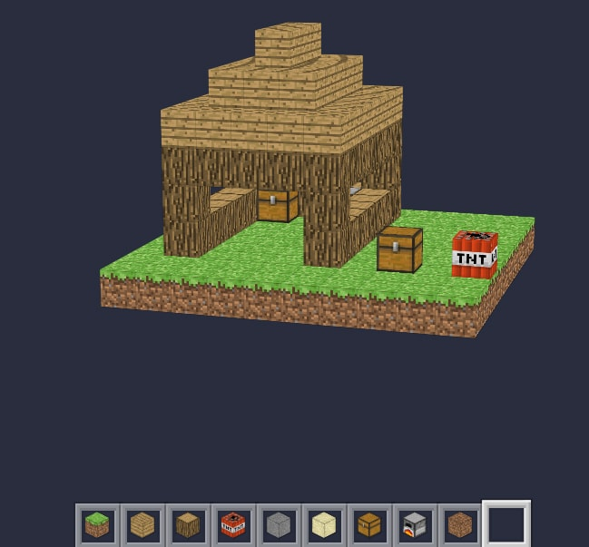

# CSS3. Build and Mine

[Demonstration](https://maksabuzyarov.github.io/css3-build-and-mine/)

### How use builder?
 
1. Clone
1. Run `npm i`
1. Run `npm run dev` for live reload or `npm run buld` for prod. build
1. Open: `docs/index.html`
1. Enjoy!

### Preview

